<div align="center">

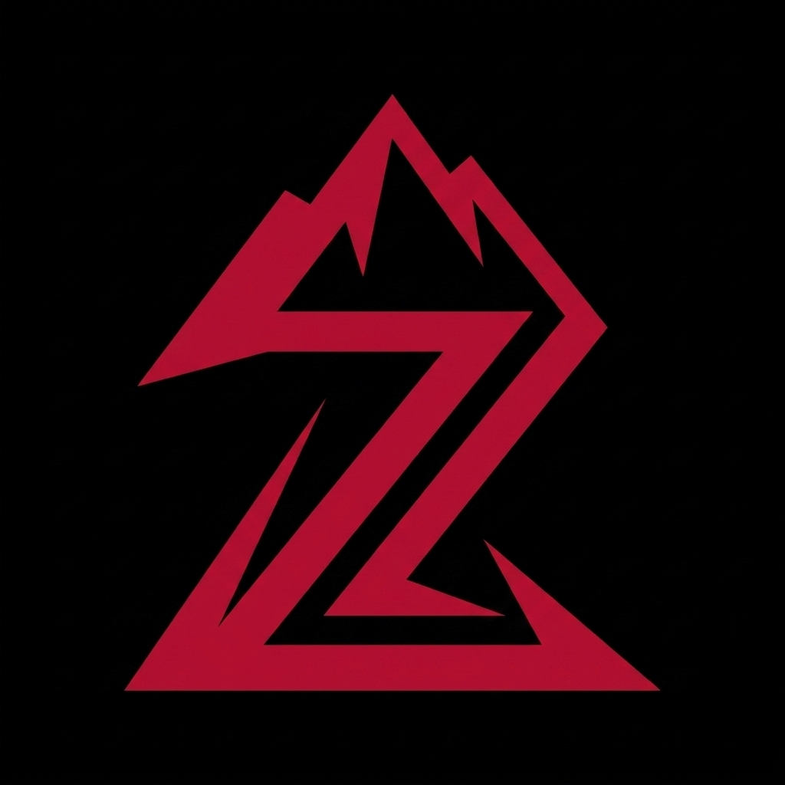

# ⛰️ ZENITH

### *Own the peak.*

A local-first personal tracker for **training, nutrition, study, sleep, water, bike fuel, and a full calendar** — one gothic, offline dashboard. No account, no server, your data never leaves your device.


**19 screens · 149-exercise library · 3 built-in training splits · 83 achievements · zero backend required**

</div>

---

## 📸 See it in action

<table>
<tr>
<td width="25%">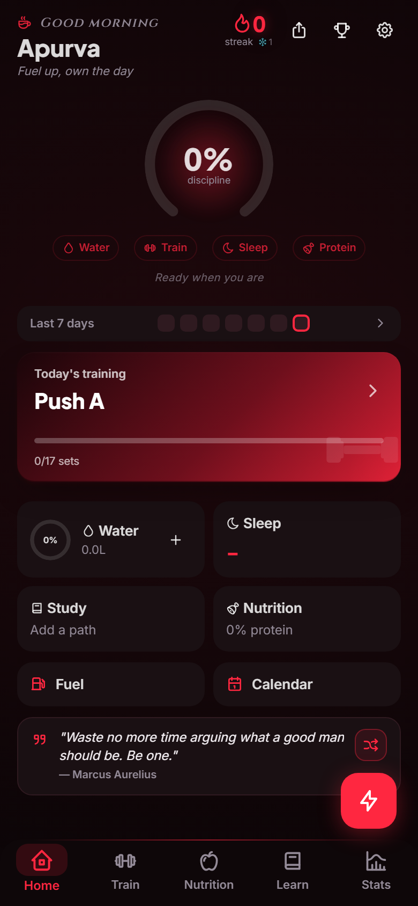</td>
<td width="25%">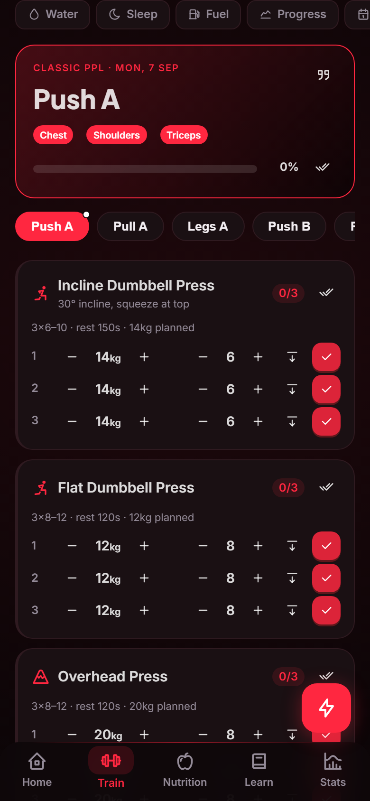</td>
<td width="25%">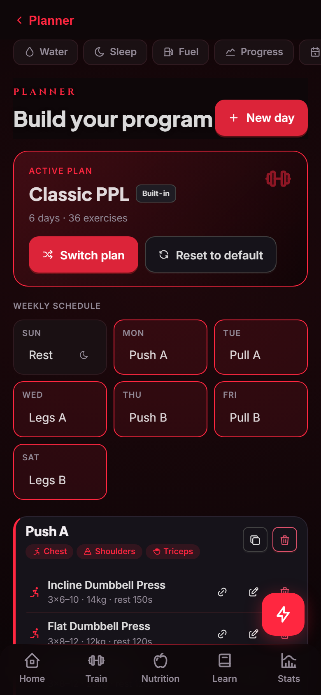</td>
<td width="25%">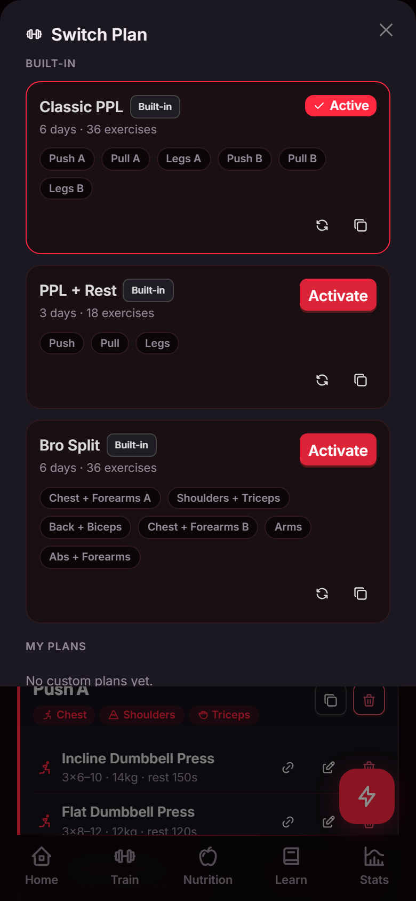</td>
</tr>
<tr>
<td align="center"><sub><b>Home</b> — glass discipline ring, parallax greeting</sub></td>
<td align="center"><sub><b>Train</b> — log a session, zero friction</sub></td>
<td align="center"><sub><b>Planner</b> — build your split</sub></td>
<td align="center"><sub><b>Switch Plan</b> — flip splits instantly</sub></td>
</tr>
<tr>
<td width="25%">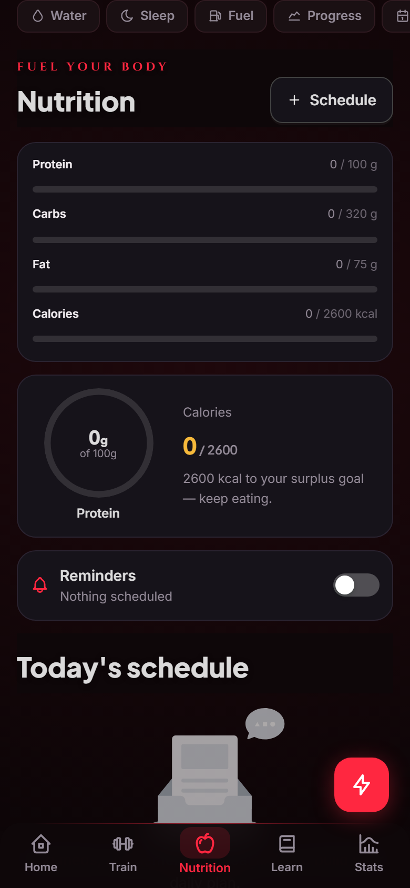</td>
<td width="25%">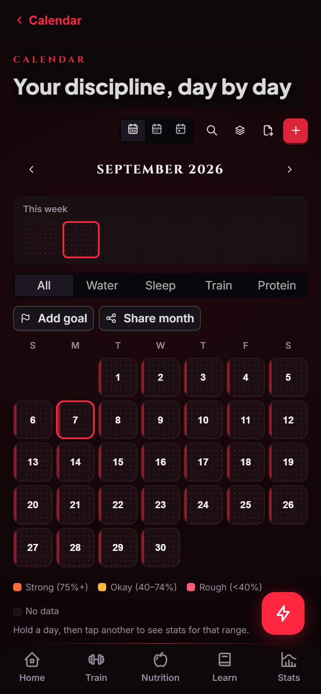</td>
<td width="25%">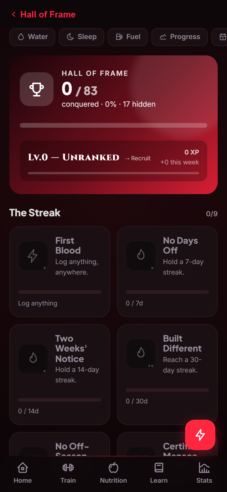</td>
<td width="25%">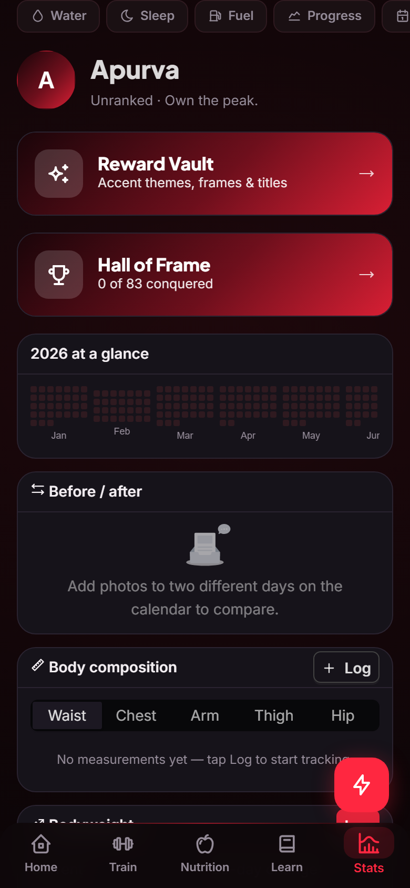</td>
</tr>
<tr>
<td align="center"><sub><b>Nutrition</b> — macros at a glance</sub></td>
<td align="center"><sub><b>Calendar</b> — discipline, day by day</sub></td>
<td align="center"><sub><b>Hall of Frame</b> — 83 badges to earn</sub></td>
<td align="center"><sub><b>Stats</b> — insights that matter</sub></td>
</tr>
<tr>
<td width="25%">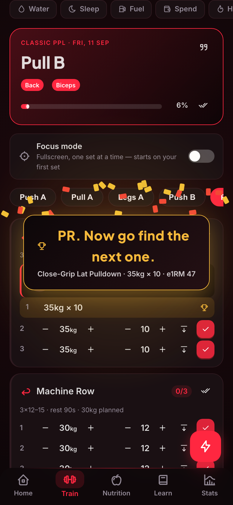</td>
<td width="25%">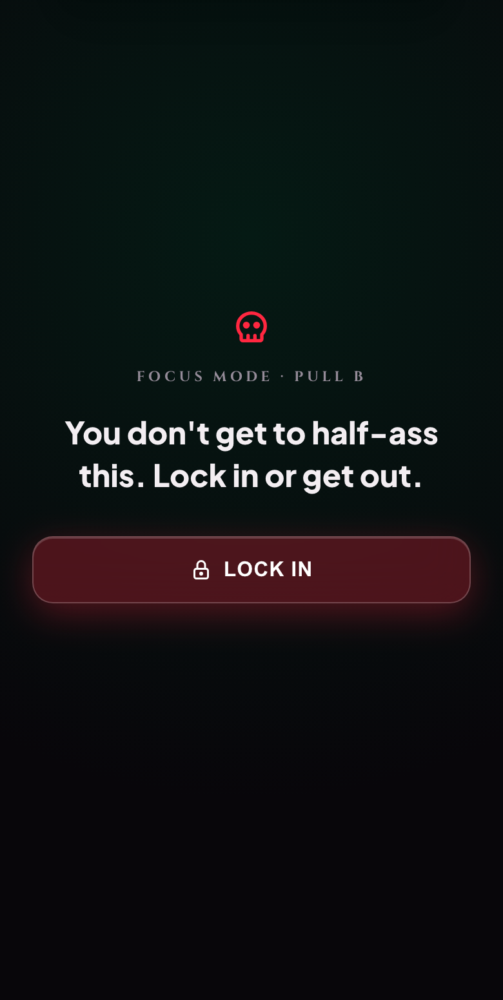</td>
<td width="25%">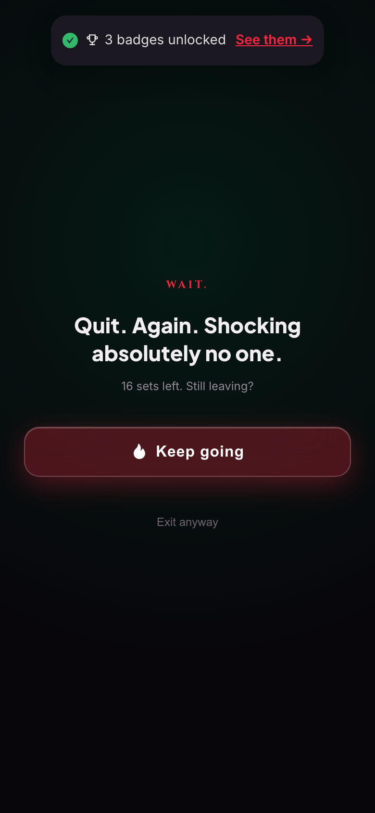</td>
<td width="25%">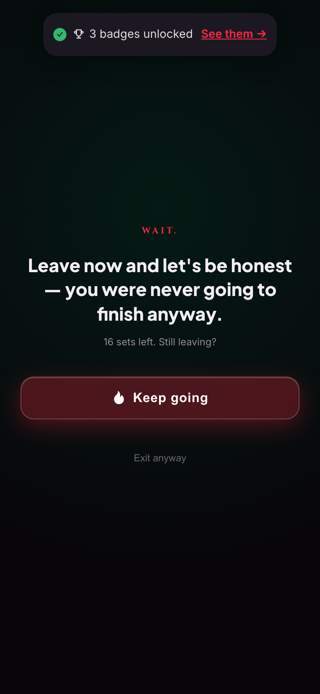</td>
</tr>
<tr>
<td align="center"><sub><b>PR Celebration</b> — a brutal one-liner every time you beat yourself</sub></td>
<td align="center"><sub><b>Focus Mode</b> — sign the contract before you lift</sub></td>
<td align="center"><sub><b>Try to leave early</b> — it won't go well</sub></td>
<td align="center"><sub><b>Try again</b> — still won't</sub></td>
</tr>
</table>

---

## ✨ Highlights

- 🏋️ **Multiple switchable training plans** — 3 built-in splits (Classic PPL, PPL + Rest, Bro Split) plus unlimited custom plans, each a full 7-day program you build once and flip between in one tap. Switching never loses progress — your outgoing plan is saved automatically.
- ⚡ **Two-screen gym engine** — a minimal Session Logger for the gym (progress bar, +/− weight/reps, tap to complete, drop sets, supersets, rest timer) and a full Workout Planner for the couch (149-exercise library, custom days, weekly schedule, progressive-overload nudges)
- 🔒 **Focus Mode** — fullscreen, one set at a time, starting on your first logged set. A "lock in" gate makes you commit before it lets you see set one, and trying to back out mid-session gets a brutal, randomized quit-shame screen instead of a plain confirm dialog
- 📊 **Discipline score** — a glass "dish" ring on Home that tells you if today is on track (water + training + sleep + protein, averaged), with scroll parallax, a staggered entrance cascade, and a kinetic digit-flicker when you're falling behind
- 🏆 **Brutal PR celebrations & level-ups** — every PR fires a full-bleed one-liner ("PR. Now go find the next one.") instead of a generic toast; leveling up gets a cinematic screen-flash + tier-banded flavor text that gets harsher the higher you climb
- 📉 **"Weaker than last time" call-outs** — a logged set that came in under your ghost from last session gets flagged inline, not just silently under-highlighted
- 📅 **Discipline calendar** — month grid colored by daily score with per-metric filters, streak freeze, workout backfill, on-this-day comparisons, goal countdowns, photo pins, range stats, and a GitHub-style year heatmap
- 🗓️ **Full Month/Week/Day calendar** — a unified tasks & events system underneath it, draw-to-create time blocks, recurring events, all-day/multi-day spans, and real two-way Google Calendar sync
- ⚡ **XP + Levels** — every action earns XP. 21 levels from Recruit to Zenith.
- 🏆 **83 achievement badges** — 5 tiers (bronze → mythic), 17 mystery, earned by real milestones
- 🏅 **Social leaderboard** — follow friends by share code, compete on weekly discipline %, streak, volume. See each other's top badges.
- 🌅 **Time-aware greeting** — 7 time-of-day slots with matching icons, taglines, and evolving gradients from dawn to late night
- 💬 **Motivation deck** — swipeable quote cards you can add/edit/favorite by category (gym / study / life)
- 🖤 **Gothic dark mode** — black + aggressive red by default, with a one-tap Light toggle
- ⚡ **Quick-Log FAB** — floating action button on every screen, one tap to log water, meals, or jump to any tracker
- 🎨 **Make it yours** — custom profile picture, wallpaper with blur & opacity controls
- ☁️ **Optional cloud sync** — encrypted backup with email-code login, auto-push on change
- 🔔 **Smart reminders** — adaptive copy ("you're 700ml behind"), native push on mobile
- 📴 **Works anywhere** — offline, installable, phone-ready, zero backend required
- 💾 **You own the data** — one-tap JSON backup & restore, plus AES-encrypted export

## 🥊 Built-in training plans

| Plan | Split | Days/week |
|---|---|---|
| **Classic PPL** | Push A · Pull A · Legs A · Push B · Pull B · Legs B | 6 |
| **PPL + Rest** | Push · Pull · Legs · Rest · Push · Pull · Legs | 6 |
| **Bro Split** | Chest+Forearms · Shoulders+Triceps · Back+Biceps · Chest+Forearms · Arms · Abs+Forearms · Rest | 6 |

Every day ships with hand-picked exercises, sets, rep ranges, and rest timers — pulled straight from the 149-exercise library. Swap any exercise, tweak the numbers, or build a plan from scratch; switching plans always keeps the one you're leaving intact.

## 📦 Modules

| | Module | What it tracks |
|---|---|---|
| 🏠 | **Home** | Discipline ring, unified streak, training card, water quick-add, sleep, study up-next |
| ⚡ | **Train** | Session Logger — execute today's workout with minimal taps |
| 📋 | **Planner** | Build days, pick exercises, set weights, assign a weekly schedule, switch between plans |
| 📊 | **Progress** | Per-exercise e1RM trend, volume, % gain, PR log |
| 🍽️ | **Nutrition** | Meals & macros, calorie/protein targets, supplement schedule |
| 📚 | **Study** | Learning paths, topic backlog, auto "up next", notes, time logging |
| 💧 | **Water** | Pace-aware hydration with warnings, quick-add, 7-day chart |
| 😴 | **Sleep** | Bed/wake logging, duration, quality, weekly sleep-debt |
| ⛽ | **Fuel** | Full-to-full bike mileage (km/L), monthly spend, cost per km |
| 📅 | **Calendar** | Month/Week/Day views, tasks & events, discipline overlay, Google Calendar sync |
| 💬 | **Motivation** | Swipeable quote deck by category (gym / study / life) — add, edit, favorite, delete |
| 🏆 | **Hall of Frame** | 83 achievements (17 mystery), tiered badges, live progress on everything still locked |
| 📈 | **Stats** | Read-only insights — weekly review, year heatmap, photo timeline, efficiency, body composition |
| ⚙️ | **Settings** | Profile & daily targets, appearance, reminders, cloud sync, backup |

## 🛠 Tech stack

**React 19** · **TypeScript (strict)** · **Vite 5** · **Ant Design 5** · **Dexie (IndexedDB)** · **Framer Motion** · **Recharts** · **react-icons (Tabler)** · **React Router 6** · **dayjs**

## 🚀 Quick start

```bash
npm install
npm run dev        # prints Local + Network URL
```

On your phone (same Wi-Fi), open the **Network** URL.

## ☁️ Deploy

```bash
npm run build      # → /dist
```

Import the repo on **Vercel**, framework preset **Vite**, deploy. Fully static — no environment variables required unless you turn on optional cloud sync.

## 📲 Native app

```bash
npm i @capacitor/core @capacitor/cli
npx cap init Zenith com.apurva.zenith --web-dir=dist
npx cap add ios && npm run build && npx cap sync
```

## 🧱 Architecture

```
UI (features/*/*.tsx)        ← presentational only
  └─ data hooks (use*.ts)    ← the ONLY place data is read/written
       └─ db (IndexedDB)     ← typed tables + export/import
```

## 🔒 Privacy

100% on-device by default. No analytics, no account required. Cloud sync is entirely optional and off unless you turn it on.

## 📄 License

MIT

<div align="center"><sub>Built with discipline · by Apurva</sub></div>
